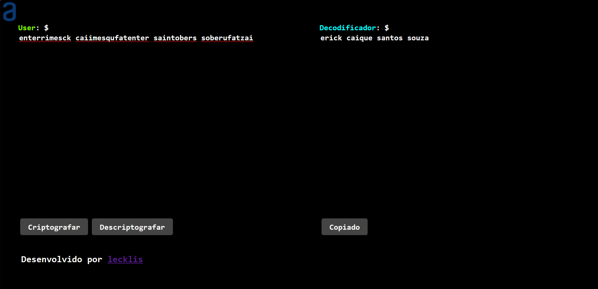
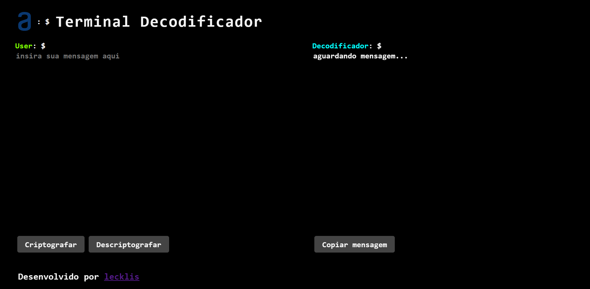

<h1>Terminal Decodificador</h1>

 

<h2>Challenge Alura ONE</h2>

 

<h3>DevLog</h3>
<h4>v1 released</h4>

<h4>v2 released</h4>
<h5>Animations</h5>
<h5>fixed copy button</h5>
<h5>fixed mobile errors</h5>

